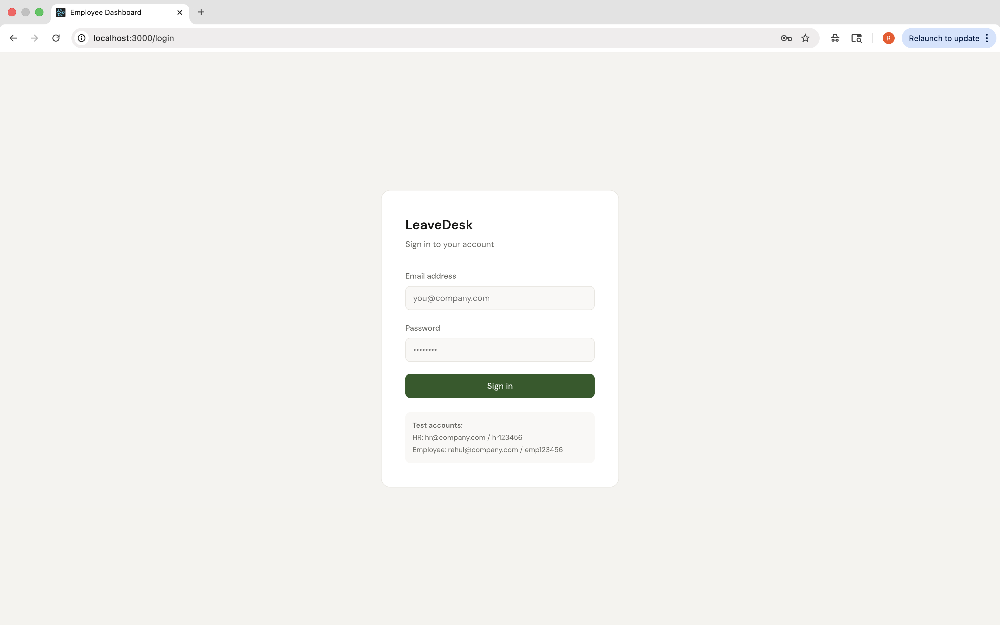
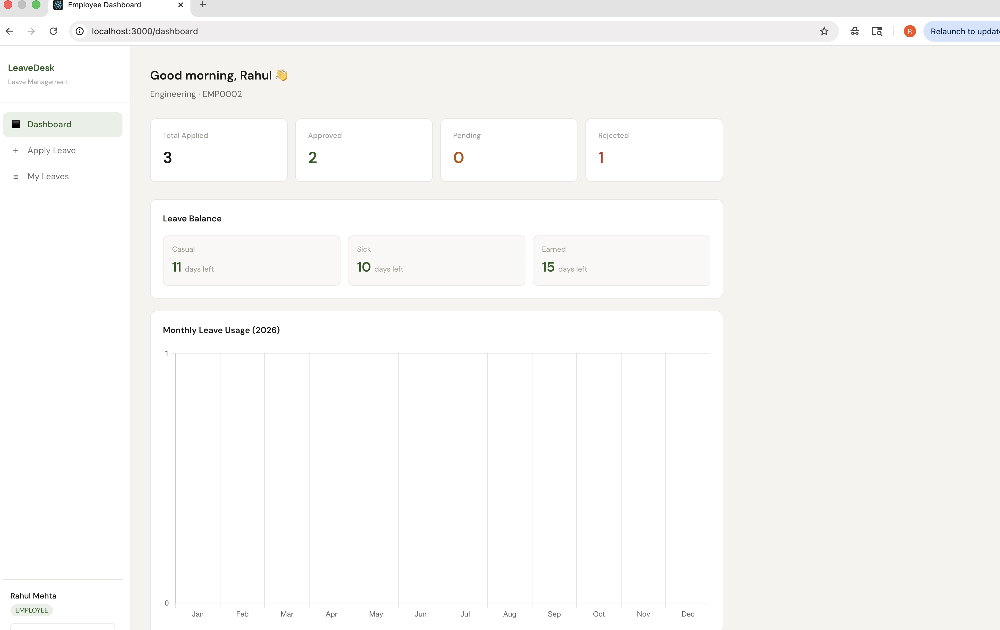
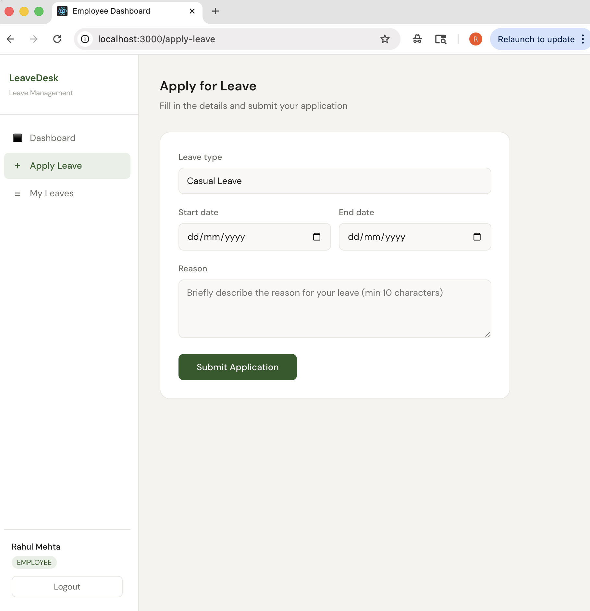
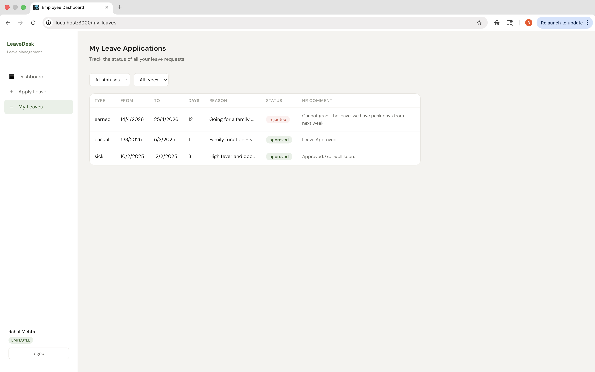
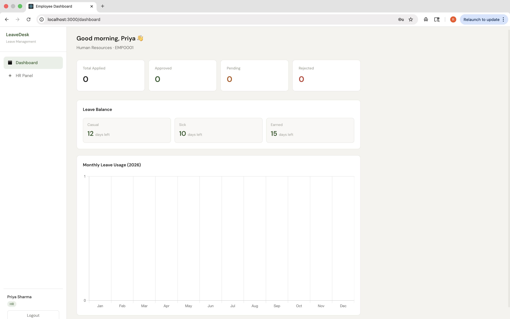

# Employee Leave Management System

A full-stack web application for managing employee leave requests with role-based access control. Built with the MERN stack (MongoDB, Express.js, React, Node.js) and deployed on Render and Vercel.

**Live Demo:** [frontend-link.vercel.app](https://your-frontend.vercel.app) &nbsp;|&nbsp; **API:** [backend-link.onrender.com](https://your-backend.onrender.com)

---

## Screenshots

### Login


### Employee Dashboard


### Apply for Leave


### My Leave History


### HR Panel


---

## Features

**Employee**
- Secure login with JWT authentication
- Apply for casual, sick, or earned leave
- Real-time leave balance tracking
- View full leave history with status and HR comments
- Cancel pending applications

**HR**
- View all employee leave applications with filters
- Approve or reject leaves with an optional comment
- Automatic leave balance deduction on approval
- Department-wise filtering

**System**
- Role-based access — employees cannot access HR routes
- Overlap detection — prevents duplicate leave applications for same dates
- Auto-generated employee IDs (EMP0001, EMP0002...)
- Monthly leave usage chart (Chart.js)
- MongoDB aggregation for summary statistics

---

## Tech Stack

| Layer | Technology |
|---|---|
| Frontend | React.js, React Router, Axios, Chart.js |
| Backend | Node.js, Express.js |
| Database | MongoDB Atlas, Mongoose ODM |
| Auth | JWT (JSON Web Tokens), bcryptjs |
| Deployment | Vercel (frontend), Render (backend) |

---

## Project Structure

```
employee-leave-system/
├── employee-leave-backend/
│   ├── models/
│   │   ├── User.js          # User schema — roles, leave balance, employee ID
│   │   └── Leave.js         # Leave schema — type, dates, status, HR comment
│   ├── routes/
│   │   ├── auth.js          # Register, login, profile
│   │   ├── leave.js         # Apply, view, approve/reject, cancel, summary
│   │   └── employee.js      # HR employee management
│   ├── middleware/
│   │   └── authMiddleware.js # JWT verification + HR role guard
│   ├── server.js
│   └── seed.js              # Test data seeder
│
├── employee-leave-frontend/
│   ├── src/
│   │   ├── context/
│   │   │   └── AuthContext.js   # Global auth state
│   │   ├── components/
│   │   │   └── Layout.js        # Sidebar + navigation
│   │   ├── pages/
│   │   │   ├── Login.js
│   │   │   ├── Dashboard.js     # Stats + Chart.js bar chart
│   │   │   ├── ApplyLeave.js
│   │   │   ├── MyLeaves.js
│   │   │   └── HRPanel.js       # Approve/reject with comment modal
│   │   └── api.js               # Axios instance with JWT interceptor
│
└── screenshots/
```

---

## Getting Started Locally

### Prerequisites
- Node.js v18+
- MongoDB Atlas account (free tier works)

### 1. Clone the repo

```bash
git clone https://github.com/your-username/employee-leave-system.git
cd employee-leave-system
```

### 2. Set up the backend

```bash
cd employee-leave-backend
npm install
```

Create a `.env` file:

```
PORT=5000
MONGO_URI=your_mongodb_atlas_connection_string
JWT_SECRET=your_secret_key
```

Seed test data and start:

```bash
node seed.js
npm run dev
```

### 3. Set up the frontend

```bash
cd ../employee-leave-frontend
npm install
```

Create a `.env` file:

```
REACT_APP_API_URL=http://localhost:5000/api
```

Start:

```bash
npm start
```

App runs at `http://localhost:3000`

---

## API Endpoints

### Auth
| Method | Endpoint | Description |
|---|---|---|
| POST | `/api/auth/register` | Register new user |
| POST | `/api/auth/login` | Login and get JWT token |
| GET | `/api/auth/me` | Get logged-in user profile |

### Leave
| Method | Endpoint | Access | Description |
|---|---|---|---|
| POST | `/api/leave/apply` | Employee | Submit leave application |
| GET | `/api/leave/my-leaves` | Employee | View own leave history |
| GET | `/api/leave/summary` | Employee | Leave stats + balance |
| GET | `/api/leave/all-leaves` | HR | All employees' applications |
| PUT | `/api/leave/update-status/:id` | HR | Approve or reject leave |
| DELETE | `/api/leave/cancel/:id` | Employee | Cancel pending leave |

### Employee (HR only)
| Method | Endpoint | Description |
|---|---|---|
| GET | `/api/employee/all` | List all employees |
| GET | `/api/employee/:id` | Employee profile + leave history |

---

## Test Accounts

| Role | Email | Password |
|---|---|---|
| HR | hr@company.com | hr123456 |
| Employee | rahul@company.com | emp123456 |
| Employee | sneha@company.com | emp123456 |

---

## Deployment

**Backend → Render (free)**
1. Push code to GitHub
2. Go to [render.com](https://render.com) → New Web Service → connect repo
3. Set build command: `npm install`
4. Set start command: `node server.js`
5. Add environment variables: `MONGO_URI`, `JWT_SECRET`, `PORT`

**Frontend → Vercel (free)**
1. Go to [vercel.com](https://vercel.com) → New Project → connect repo
2. Set root directory to `employee-leave-frontend`
3. Add environment variable: `REACT_APP_API_URL=https://your-backend.onrender.com/api`

---

## Author

**Rashi Goyal**  
B.Tech Computer Science, Ajeenkya DY Patil University  
[LinkedIn](https://linkedin.com/in/your-profile) · [GitHub](https://github.com/your-username)